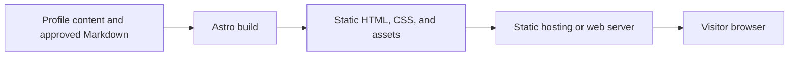
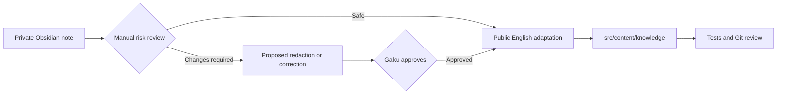

# Gaku Personal Website - Technical Design

## 1. Purpose

This document records the current architecture and the preferred extension points for future features. The default principle is to keep the site static, content-first, and inexpensive to operate until a proven requirement needs server-side state.

## 2. Current Architecture

The website uses Astro 7 and TypeScript. Astro generates static HTML at build time, with browser JavaScript used only for small homepage interactions.



Current characteristics:

- No application backend or database.
- No user accounts or private content.
- One profile page and a public Knowledge section.
- Typed Markdown metadata through Astro content collections.
- Production-output tests using Node's built-in test runner.
- English-only public content.

## 3. Repository Structure

```text
gaku-site/
├── public/                      Static assets copied as-is
├── src/
│   ├── content/
│   │   └── knowledge/          Approved public Markdown copies
│   ├── layouts/                Shared page shells and metadata
│   ├── pages/                  File-based routes
│   │   └── knowledge/          Knowledge index and article route
│   ├── styles/                 Global visual system
│   └── content.config.ts       Content schema and validation
├── tests/                      Build-output regression tests
├── astro.config.mjs            Site and build configuration
├── PRODUCT_DESIGN.md           Product scope and user experience
└── TECHNICAL_DESIGN.md         Architecture and evolution guidance
```

New code should stay within these ownership boundaries. Reusable page chrome belongs in `layouts`, public authored content belongs in `content`, route composition belongs in `pages`, and site-wide design rules belong in `styles`.

## 4. Content Model

The `knowledge` collection currently requires:

| Field | Purpose |
| --- | --- |
| `title` | Public article title |
| `description` | Index summary and metadata description |
| `category` | High-level content grouping |
| `tags` | More specific discovery terms |
| `publishedAt` | First public publication date |
| `reviewedAt` | Most recent accuracy review date |

The category schema is intentionally strict today. When adding a new subject such as investing, update the schema deliberately rather than storing arbitrary category strings.

Recommended future additions, only when needed:

- `draft`: exclude incomplete entries from production builds.
- `updatedAt`: distinguish editorial changes from factual review.
- `sourceLanguage`: preserve translation provenance.
- `disclaimer`: attach a visible subject-specific notice.
- `series`: group multi-part articles.

## 5. Publication Boundary

Obsidian remains a private writing environment. The website must never build directly from the full vault.



For each requested publication:

1. Review only the notes explicitly selected by Gaku.
2. Check credentials, customer or case data, resource identifiers, internal links and procedures, copyright, and personal financial information.
3. Verify time-sensitive technical claims against authoritative public sources.
4. Present material corrections or redactions for approval before publication.
5. Add an adapted public copy to this repository without modifying the Obsidian source.
6. Require a passing build, tests, credential scan, and Git diff review before commit or push.

## 6. Routing and Rendering

Astro file-based routing currently produces:

```text
/                                      Profile
/knowledge/                            Knowledge index
/knowledge/application-gateway/        Article
/knowledge/kerberos/                   Article
```

`src/pages/knowledge/[...slug].astro` generates one static article route per content entry. Keep this build-time model for public articles because it provides fast pages, predictable SEO, and no runtime data dependency.

If the collection grows, prefer derived static pages for categories and tags. Do not introduce a database merely to list or filter public Markdown.

## 7. Future Feature Strategy

### Investment Notes

Start as a separate content collection or a clearly distinct category with its own layout and disclaimer. Keep technical reference content and personal investment commentary visually and semantically separate.

Never publish account numbers, balances, transaction identifiers, tax information, or screenshots containing brokerage details. Content should be framed as personal research and reflection, not personalized financial advice.

### Search

Add search only after browsing by index, category, and tags becomes inconvenient. Prefer a static search index such as Pagefind before using a hosted search service or database.

### Comments

If public discussion becomes useful, prefer Giscus backed by GitHub Discussions. This avoids operating authentication, storage, spam controls, and moderation infrastructure. A custom comment backend should be considered only if requiring a GitHub account becomes a demonstrated barrier.

### Obsidian Automation

Keep publication manual for now. Consider a one-way publishing tool only when repeated copying and link conversion becomes costly. Any future tool must be opt-in, copy only explicitly approved notes and referenced assets, fail closed on validation errors, and never modify the source vault.

### Dynamic Applications

Interactive calculators or visualizations can be isolated as Astro islands using a suitable UI framework. Introduce server APIs or a database only for features that require durable private state, such as accounts, saved preferences, private notes, or custom comments.

## 8. Deployment

The build output is the `dist/` directory and can be served by any static host or conventional web server.

Deployment choices:

- **GitHub Pages:** simple and repository-native. A project site at `Sugoigaku.github.io/gaku-site` requires the Astro `base` path and base-aware links/assets, unless a custom domain removes the subpath.
- **Cloudflare Pages or Vercel:** automatic builds, previews, and root-path hosting with little configuration.
- **Azure static hosting or a VM:** appropriate when Azure ownership or infrastructure learning is itself a goal, but operational work is higher than the current site requires.

Deployment should run `npm test` and `npm run check` before publishing. Secrets, if ever required by build tooling, must be stored in the hosting platform's secret store and never committed.

The reusable Azure VM deployment is defined in `infra/azure-vm/main.bicep`. It is subscription-scoped so it can create its own resource group, delegates resource creation to a resource-group-scoped module, accepts the SSH public key as a secure runtime parameter, and derives a globally unique DNS label without embedding subscription-specific values. The VM uses cloud-init to build the selected Git revision and serve the static output through Nginx.

The preferred low-cost deployment is defined separately in `infra/static-web-app/main.bicep`. It creates an Azure Static Web Apps Free resource with an autogenerated HTTPS endpoint. The built `dist/` directory is uploaded independently with a runtime deployment token, keeping credentials out of Bicep, Git history, and repository configuration.

## 9. Quality and Security

Every change must include or update relevant tests and receive its own Git commit.

Minimum checks:

```sh
npm test
npm run check
```

The test suite should continue to verify:

- Required routes and semantic landmarks.
- Metadata and one primary heading per page.
- Navigation and external-link safety.
- Published article presence and review context.
- Absence of unresolved Obsidian wikilinks.
- Absence of common credential patterns in build output.

For UI changes, also inspect representative desktop and mobile widths for overflow, text collision, keyboard access, and image loading.

## 10. Architecture Decision Rules

Keep the static Astro architecture unless one of these conditions becomes real:

| Requirement | Likely change |
| --- | --- |
| More public articles | Extend content collections and static routes |
| Too many articles to browse | Add categories, tags, then static search |
| Reader discussion | Add Giscus first |
| Rich client-only tool | Add an isolated Astro island |
| Accounts or private personalized data | Add authentication, server runtime, and database |
| Frequent multi-author editing | Evaluate a headless CMS |
| Repetitive approved-note publishing | Design a one-way validation and copy tool |

Framework migration should be the last option. Astro can host framework components and server-rendered routes if the product grows, so adding one dynamic feature does not by itself justify rewriting the site.