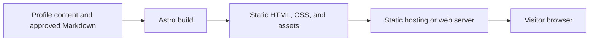
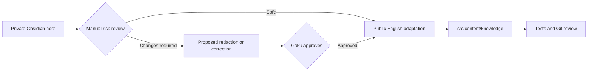

# Gaku Personal Website - Technical Design

## 1. Purpose

This document records the current architecture and the preferred extension points for future features. The default principle is to keep the site static, content-first, and inexpensive to operate until a proven requirement needs server-side state.

## 2. Current Architecture

The website uses Astro 7 and TypeScript. Astro generates static HTML at build time, with browser JavaScript used only for homepage interactions and progressive enhancement of case-study section navigation.



Current characteristics:

- No application backend or database.
- No user accounts or private content.
- One About/profile page, a separate Project index and static case study, and a public Knowledge section.
- Typed Markdown metadata through Astro content collections.
- Production-output tests using Node's built-in test runner.
- English-only public content.

## 3. Repository Structure

```text
gaku-site/
├── public/                      Static assets copied as-is
├── src/
│   ├── content/
│   │   └── knowledge/          Approved public Markdown copies
│   ├── components/             Project index preview
│   ├── layouts/                Shared page shells and metadata
│   ├── pages/                  File-based routes
│   │   ├── knowledge/          Knowledge index and article route
│   │   └── projects/           Project index and static case studies
│   ├── styles/                 Global visual system
│   └── content.config.ts       Content schema and validation
├── tests/                      Build-output regression tests
├── astro.config.mjs            Site and build configuration
├── PRODUCT_DESIGN.md           Product scope and user experience
└── TECHNICAL_DESIGN.md         Architecture and evolution guidance
```

New code should stay within these ownership boundaries. Reusable page chrome belongs in `layouts`, public authored content belongs in `content`, route composition belongs in `pages`, and site-wide design rules belong in `styles`.

## 4. Content Model

The `knowledge` collection currently requires:

| Field | Purpose |
| --- | --- |
| `title` | Public article title |
| `description` | Index summary and metadata description |
| `category` | High-level content grouping |
| `tags` | More specific discovery terms |
| `publishedAt` | First public publication date |
| `reviewedAt` | Most recent accuracy review date |

The category schema is intentionally strict today. When adding a new subject such as investing, update the schema deliberately rather than storing arbitrary category strings.

Recommended future additions, only when needed:

- `draft`: exclude incomplete entries from production builds.
- `updatedAt`: distinguish editorial changes from factual review.
- `sourceLanguage`: preserve translation provenance.
- `disclaimer`: attach a visible subject-specific notice.
- `series`: group multi-part articles.

## 5. Publication Boundary

Obsidian remains a private writing environment. The website must never build directly from the full vault.



For each requested publication:

1. Review only the notes explicitly selected by Gaku.
2. Check credentials, customer or case data, resource identifiers, internal links and procedures, copyright, and personal financial information.
3. Verify time-sensitive technical claims against authoritative public sources.
4. Present material corrections or redactions for approval before publication.
5. Add an adapted public copy to this repository without modifying the Obsidian source.
6. Require a passing build, tests, credential scan, and Git diff review before commit or push.

## 6. Routing and Rendering

Astro file-based routing currently produces:

```text
/                                      Profile
/projects/                              Project index
/projects/gaku-site/                    Personal website case study
/projects/gaku-skills/                  Copilot skills case study
/knowledge/                            Knowledge index
/knowledge/application-gateway/        Article
/knowledge/kerberos/                   Article
```

`src/pages/knowledge/[...slug].astro` generates one static article route per content entry. Keep this build-time model for public articles because it provides fast pages, predictable SEO, and no runtime data dependency.

If the collection grows, prefer derived static pages for categories and tags. Do not introduce a database merely to list or filter public Markdown.

### Project Portfolio Implementation

The approved portfolio is implemented in the application source. The standalone demos and demo-only tests have been removed; Git history retains the design iterations. Local implementation is not evidence of a production deployment.

| File | Responsibility |
| --- | --- |
| `src/components/ProjectPreview.astro` | Project index heading, screenshot, summary, technologies, case-study and source links; component-scoped styling |
| `src/pages/index.astro` | About/profile page with work history, interests and Contact; links to Project without embedding a preview |
| `src/pages/projects/index.astro` | Standalone Project index reusing the preview inside the shared content layout |
| `src/pages/projects/gaku-site.astro` | Static case-study content, three section definitions, and typed browser navigation script |
| `src/pages/projects/gaku-skills.astro` | Public-repository-based skills overview, native section links, source references, and explicit validation boundaries |
| `src/layouts/ContentLayout.astro` | Shared Knowledge/Projects shell, header, skip link, footer, canonical URL and Open Graph metadata |
| `src/layouts/KnowledgeLayout.astro` | Compatibility wrapper retaining existing title/description props for Knowledge routes |
| `src/styles/projects.css` | Case-study styling scoped under `.portfolio`; reuses global fonts, colors and controls |
| `public/projects/gaku-site-desktop.png` | Existing 1440 x 1000 screenshot, shown in the Project index and referenced in case-study social metadata |
| `public/icons/arrow-*.svg` | Local Lucide arrows, preserving the original license notices |
| `tests/projects.test.mjs` | Production-output regression coverage for the preview, route, content, navigation targets, assets and documentation |

The two case studies are authored directly in Astro; a project content schema is deferred until repeated editing warrants it. Both reuse the shared content shell and portfolio styles. The personal website case study has three sections: Project & Delivery (`#build`), Key Decisions (`#decisions`), and What's Next (`#next`). Its decisions also have stable nested anchors, such as `#decision-hosting`. Its own preview and case study retain the approved 950-word combined copy budget and 110-word per-decision limit, independently of other projects.

Gaku Skills reuses these section IDs on its separate route, with Boundaries & Next Steps as the final section. Desktop and mobile use native links without JavaScript. The project index presents a semantic HTML workflow diagram for this skill instead of a remote image dependency. Descriptions reflect the public repository reviewed on September 20, 2026; no skill installation, session reading, or generated evidence import occurs in this website.

Shared navigation and personal website case-study behavior:

- Main navigation is ordered About, Knowledge, Project, Contact. About and Contact target the profile page; Project opens `/projects/`. Experience remains in the profile body but has no top-level navigation entry.
- Project return links target `/projects/`, while `/projects/gaku-site/` can be loaded or shared independently. No link relies on a homepage Projects section.
- The desktop sidebar and mobile selector are generated from the same section array. Native fragment navigation preserves browser history and direct links.
- JavaScript reveals the mobile selector, focuses the selected heading without an extra focus scroll, and updates the sidebar's `aria-current="location"` on hash changes, scroll, page restoration and resize.
- Scroll handling is throttled with `requestAnimationFrame`. At the bottom of the document, the final section stays selected even when there is insufficient content to align it at the top.
- Global 80px scroll padding plus case-study scroll margins provide 112px desktop and 164px mobile anchor offsets. The mobile selector sits below the 76px header. Existing reduced-motion rules apply.
- Without JavaScript, all content remains rendered and readable. Native mobile section links replace the selector through `noscript`; desktop links work unchanged.

The content shell uses the same four navigation labels as the homepage without changing Knowledge routes or their content API. Canonical and Open Graph URLs use the configured Astro site origin; the project screenshot supplies the case-study sharing image. The homepage keeps its existing hero, menu, work history and contact controls.

Assets were promoted from the approved design, not fetched again. The screenshot was captured on September 13, 2026 and contains the site's existing imagery. The three arrows are from `lucide-static@0.468.0`. No new runtime dependency, backend, secret, build plugin, or Azure resource is introduced. Fonts and the homepage's existing remote images remain external dependencies.

## 7. Future Feature Strategy

### Investment Notes

Start as a separate content collection or a clearly distinct category with its own layout and disclaimer. Keep technical reference content and personal investment commentary visually and semantically separate.

Never publish account numbers, balances, transaction identifiers, tax information, or screenshots containing brokerage details. Content should be framed as personal research and reflection, not personalized financial advice.

### Search

Add search only after browsing by index, category, and tags becomes inconvenient. Prefer a static search index such as Pagefind before using a hosted search service or database.

### Comments

If public discussion becomes useful, prefer Giscus backed by GitHub Discussions. This avoids operating authentication, storage, spam controls, and moderation infrastructure. A custom comment backend should be considered only if requiring a GitHub account becomes a demonstrated barrier.

### Obsidian Automation

Keep publication manual for now. Consider a one-way publishing tool only when repeated copying and link conversion becomes costly. Any future tool must be opt-in, copy only explicitly approved notes and referenced assets, fail closed on validation errors, and never modify the source vault.

### Dynamic Applications

Interactive calculators or visualizations can be isolated as Astro islands using a suitable UI framework. Introduce server APIs or a database only for features that require durable private state, such as accounts, saved preferences, private notes, or custom comments.

## 8. Deployment

The build output is the `dist/` directory and can be served by any static host or conventional web server.

Current deployment:

- Azure Static Web Apps Free serves the site at the configured custom HTTPS domain.
- `.github/workflows/deploy-static-web-app.yml` runs `npm ci`, `npm test`, and `npm run check` on main updates or manual dispatch, then uploads `dist` using a GitHub Actions secret.
- Bicep provisioning and application uploads remain separate. Adding the project route requires no infrastructure or workflow changes.
- This portfolio implementation is local until pushed and deployed. Pull-request gates, live health checks, and recovery rehearsal remain future work.

Alternative hosting considerations:

- **GitHub Pages:** simple and repository-native. A project site at `Sugoigaku.github.io/gaku-site` requires the Astro `base` path and base-aware links/assets, unless a custom domain removes the subpath.
- **Cloudflare Pages or Vercel:** automatic builds, previews, and root-path hosting with little configuration.
- **Azure VM:** the retained reference offers server control, but adds OS and Nginx operation that the selected managed static host avoids.

Deployment should run `npm test` and `npm run check` before publishing. Secrets, if ever required by build tooling, must be stored in the hosting platform's secret store and never committed.

The reusable Azure VM deployment is defined in `infra/azure-vm/main.bicep`. It is subscription-scoped so it can create its own resource group, delegates resource creation to a resource-group-scoped module, accepts the SSH public key as a secure runtime parameter, and derives a globally unique DNS label without embedding subscription-specific values. The VM uses cloud-init to build the selected Git revision and serve the static output through Nginx.

The preferred low-cost deployment is defined separately in `infra/static-web-app/main.bicep`. It creates an Azure Static Web Apps Free resource with an autogenerated HTTPS endpoint and optional managed custom-domain binding. The built `dist/` directory is uploaded independently with a runtime deployment token, keeping credentials out of Bicep, Git history, and repository configuration.

## 9. Quality and Security

Every change must include or update relevant tests and receive its own Git commit.

Minimum checks:

```sh
npm test
npm run check
```

The test suite should continue to verify:

- Required routes and semantic landmarks.
- Metadata and one primary heading per page.
- Navigation and external-link safety.
- Published article presence and review context.
- Absence of unresolved Obsidian wikilinks.
- Absence of common credential patterns in build output.
- Project preview placement, case-study metadata, the three-section order, unique anchor targets, concise decision content, explicit future-work labels, and deployed local assets.
- Removal of obsolete standalone demo files and documentation references.

For UI changes, also inspect representative desktop and mobile widths for overflow, text collision, keyboard access, and image loading.

The portfolio was checked against the built output at 1440px, 390px, and 320px widths. Browser coverage includes homepage-to-case navigation, mobile menu closure, section selection, sticky offsets, nested links, browser Back, skip-link focus, Knowledge navigation, and mobile navigation with scripts disabled. These local checks do not establish live uptime, an audited total bill, or tested production recovery.

## 10. Architecture Decision Rules

Keep the static Astro architecture unless one of these conditions becomes real:

| Requirement | Likely change |
| --- | --- |
| More public articles | Extend content collections and static routes |
| Too many articles to browse | Add categories, tags, then static search |
| Reader discussion | Add Giscus first |
| Rich client-only tool | Add an isolated Astro island |
| Accounts or private personalized data | Add authentication, server runtime, and database |
| Frequent multi-author editing | Evaluate a headless CMS |
| Repetitive approved-note publishing | Design a one-way validation and copy tool |

Framework migration should be the last option. Astro can host framework components and server-rendered routes if the product grows, so adding one dynamic feature does not by itself justify rewriting the site.